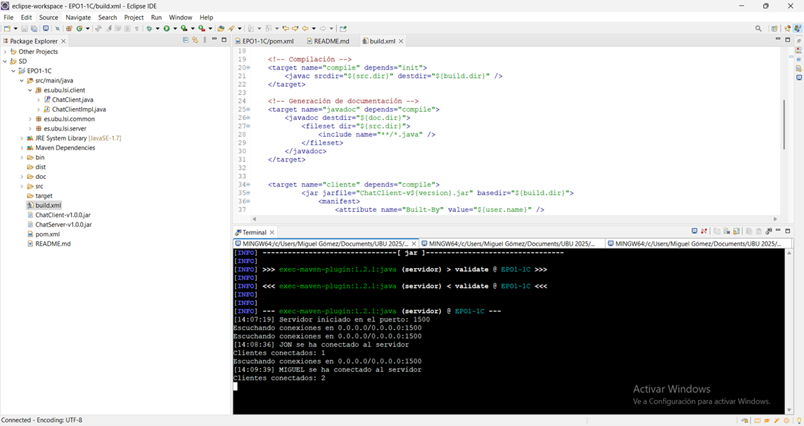
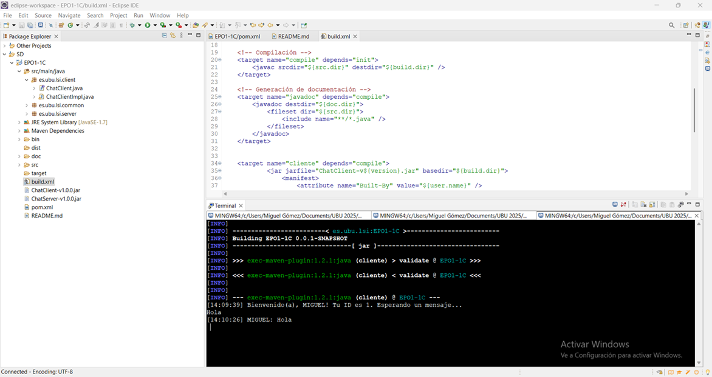

# EPO1-1C (Chat 1.0)

## Ejecución de la aplicación

Para ejecutar la aplicación, es necesario utilizar dos o más terminales, preferiblemente en un entorno Linux.

### 🚀 Iniciar el servidor
```sh
mvn exec:java@servidor
```
Ejecutar este comando desde la carpeta **EPO1-1C** para iniciar el servidor.

### 💬 Iniciar un cliente
1. Primero, asegúrate de que el servidor está en ejecución.
2. En otra terminal, dentro de la carpeta **EPO1-1C**, ejecuta:
```sh
mvn exec:java@cliente -Dexec.args="<USUARIO>"
```
Reemplaza `<USUARIO>` con el nombre que desees utilizar en el chat.

## 📌 Comandos del proyecto

| Comando             | Descripción                                          |
|---------------------|------------------------------------------------------|
| `ant init`         | Inicializa el directorio de construcción             |
| `ant compile`      | Compila el proyecto                                  |
| `ant javadoc`      | Genera la documentación                              |
| `ant cliente`      | Genera el archivo `.jar` de `ChatClientImpl`         |
| `ant servidor`     | Genera el archivo `.jar` de `ChatServerImpl`         |
| `ant all`          | Ejecuta `compile`, `javadoc`, `cliente` y `servidor` |

## 📷 Capturas
A continuación, se presentan algunas capturas del funcionamiento de la aplicación:

<p align="center">
    <br>
    <br>
    
</p>
